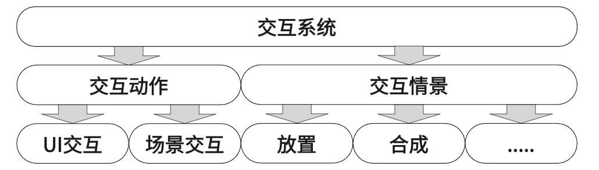

# EasyInteractive
***
## 概述
交互系统是我针对统一场景和UI交互而所研究的一套系统，主要是为了解决当有大量的场景物体和UI物体需要交互时代码凌乱耦合度过高的问题，这一套系统能够很好的将不同的交互逻辑分离开，并且能够随时更改相同物体间不同的交互逻辑，不过目前此系统还仅支持Focus、Select、Drag这几种交互动作。
***
## 总览
处理UI与UI间，UI和场景间的各种交互是很麻烦的，最终实现的代码冗长且各个交互间高度耦合，并且为了避免交互间的冲突，会有很多的判断条件，进一步降低了代码的可读性、可拓展性与可维护性。出现这种情况的原因是游戏中需要交互的对象多且杂，交互对象间的关系往往呈网状，直接写代码处理代价太大。</br>

为了避免这种问题，我们需要一种能够解耦不同交互操作，高可扩展，高可维护的交互框架。需要说明的是，这里的交互指代的是UI对象与UI对象间、UI对象与场景对象间、场景对象与场景对象间这样一个狭义的交互范围，且所有的交互都是需要玩家主动操作的，即使用键盘鼠标等输入设备进行交互操作。例如交换两个UI槽位的内容；将UI槽位中的内容放置到场景中；将场景中某个对象拖拽到另一个地方等等。</br>
本项目中实现了交互系统来解决这个问题，系统框架如图所示：

在交互系统下，游戏中的交互被分为了两个部分，交互动作与交互情景。交互动作将不同的交互对象的操作抽象为了统一的接口，也就是说UI与场景对象的交互操作是统一的，使用相同的接口。交互情景(InteractCase)则是将多个交互对象间的交互抽象，在一个交互情景下，不需要关心交互对象具体细节，也不需要关心当前交互动作的上下文关系，将每种特定的交互关系模块化，做到了解耦不同交互间的耦合。
***
## 交互动作
接下来说明交互动作是如何将不同交互操作抽象统一的。首先在本项目中我们可以确定的是，需要交互的对象有且只有特定的UI与场景对象，所以将交互操作分为两大类一类是UI交互，一类是场景交互，两类交互对象拥有的交互操作类型是相同的，都有Focus(指针聚焦)、Select(选中)、Drag(拖拽)三种操作，并且这三种操作可以囊括游戏中所有的交互操作。
``` csharp
public interface IInteractable
{
	...
}
//可聚焦接口
public interface IFocusable : IInteractable 
{
	...
}
//可选中接口
public interface ISelectable : IFocusable, IInteractable 
{
	...
}
//可拖拽接口
public interface IDragable :IFocusable, IInteractable 
{
	...
}
```
游戏UI因为有EventSystem的存在，其本身就拥有处理这些操作的能力，比如使用EventSystem.IPointerEnterHandler / EventSystem.IPointerExitHandler两个接口来实现Focus操作。而场景对象自身没有类似的处理指针交互的接口，所以项目中实现一套基于RayCast的射线检测交互系统。目前为止UI与场景都具有了进行交互的基础条件，在此基础上就可以通过接口抽象统一二者的操作。</br>
详细来说，交互系统针对每一种交互操作都提供了一个接口，实现任意一种交互操作接口的对象可以被称为一个交互对象，换句话说，就算是一个UI如果不实现任意一种交互操作接口，那么它就不能被称之为一个交互对象，自然也就不会作为交互系统的处理对象。这样的一种操作一个接口的好处就是，功能跟着接口走，按需实现，让不同交互对象的职责更清晰。
``` csharp
//一个能被聚焦和拖拽的UIItem
public class TestUIItem : UIItemController,IFocusable,IDragable
{
    ...
    public Type interactType => this.GetType();
    public void OnFocus(){}
    public void EndFocus(){}
    public void OnDrag(){}
    public void ProcessDrag(){}
    public void EndDrag(){}
    ...
}
```
如此一来，当某个对象需要Focus交互操作时，只需要实现对应的IFocusable接口，就可以在各自交互功能的支持下实现交互操作（UI下使用的是EventSystem相关接口，场景对象使用基于RayCast的射线检测交互）,至此，UI与场景的交互操作通过接口统一了。</br>
> 在UI模块一文中提到了UIItemController可以使用交互系统提供的接口来简化交互操作，这是因为UIItemController实现了EventSystem.IPointerEnterHandler / EventSystem.IPointerExitHandler两个接口，并且在各自实现的代码中都对接了交互系统，所以我们才可以在UIItem上直接实现IFocusable等IInteractable接口就可以和交互系统对接。
***
## 交互情景
接下来说明交互情景(InteractCase)是如何将多个交互对象间的交互抽象并模块化的。交互动作仅仅只是解决了不同类型的交互对象统一交互接口的问题，实际在处理多个交互对象间的交互时还是避免不了出现过多的耦合与判断，导致这个结果的关键点在于，交互代码要么分散在各个交互对象内，不易于维护与拓展；要么就把所有的交互代码写到一个脚本中，这更是导致了问题的加重。</br>
而交互情景很好的解决了上述问题，交互情景将多个交互对象间的交互抽象为：在特定的交互动作下交互主体(InteractSubject)与交互目标(InteractTarget)的一次交互。举个例子，将UI栏的塔拖拽到某个场景中的地块上放置这样一次交互，可以抽象为：拖拽UI(交互主体)，聚集地块(交互目标)，当结束拖拽时放置塔。其中结束拖拽后要做的事情交互情景并不关心，交互情景关心的是当前交互主体与其交互动作，以及当前交互目标与其交互动作，这样一来几乎所有的多个交互对象间的交互都能用交互主体、交互目标、以及各自的交互动作来描述，两个交互情景有相同的交互主体与目标，但交互动作不同，那么这两个交互情景就是不同的两种交互。
``` csharp
/// 拖拽主体并聚焦目标的交互情景
public abstract class DragSubjectFocusTargetInteractCase : AbstractInteractCase
{
	private bool _isEnter = false;
	private bool _isExit = true;
	protected bool endDrag => Input.GetMouseButtonUp(0);
	public DragSubjectFocusTargetInteractCase(Type subject,Type target) : base(subject,target){}
	protected abstract void OnExecute(IDragable subject,IFocusable target);
	public override bool Execute(IFocusable focusable, ISelectable selectable, IDragable dragable)
	{
		...
	}
	/// 进入交互情景
	protected virtual void OnEnter(IDragable subject, IFocusable target) { }
	/// 退出交互情景
	protected virtual void OnExit(IDragable subject, IFocusable target) { }
}
```
这样一来，针对某一类的交互，我们可以抽象出一个交互情景来描述，列如“拖拽主体，聚集目标”这样一种交互情景(DragSubjectFocusTargetInteractCase)，然后针对具体的某一个交互，我们可以在此交互情景的基础上填入不同类型的交互主体与交互目标，列如“放置塔”(PlacedTower : DragSubjectFocusTargetInteractCase)，UI是交互主体，地块是交互目标，交互对象类型明确，交互动作明确，那么这就是一次明确的交互。之后针对这一个交互情景再写具体的交互相关的效果代码，就能够做到高度模块化，高可拓展与高可维护了。
``` csharp
///当拖拽BackpackBeUsingRelicItem并聚焦到BackpackRelicSlotItem上时会触发此交互情景
[InteractCase(typeof(BackpackBeUsingRelicItem), typeof(BackpackRelicSlotItem))]
public class ChangeUsingRelisOrder : DragSubjectFocusTargetInteractCase
{
	...
	public ChangeUsingRelisOrder(Type subject, Type target) : base(subject, target){}
	protected override void OnEnter(IDragable subject, IFocusable target)
	{
		...
	}
	protected override void OnExecute(IDragable subject, IFocusable target)
	{
		...
	}
	protected override void OnExit(IDragable subject, IFocusable target)
	{
        ...
	}
}
```
***
## 总结
最后用一段话来形容一下整个交互系统是如何运作的：在游戏开始时，InteractiveSystem初始化，会将所有的继承自AbstractInteractCase以及由InteractCaseAttribute修饰的InteracCase实例化并保存，作为后续处理各种交互的基础。</br>
游戏开始后，所有实现了任意IInteractable接口(IFocusable\ISelectable\IDragable)的对象会作为交互对象开始检测是否与玩家输入发生互动，UI交互对象由EventSystem的IPointerHandler相关接口提供支持，场景交互对象由InteractiveSystem内的RayCast射线交互检测提供支持。</br>
同时在InteractiveSystem内，每一帧会调用所有的初始化时保存的InteractCase，并将当前的交互对象与其相对应的交互动作状态传入其中作为过滤识别特定InteractCase的依据，包括当前聚焦的对象(currentFocused)、当前选择的对象(currentSelected)与当前拖拽的对象(currentDraged)。如果当前帧的交互动作状态与交互对象双方的类型符合某个InteractCase的要求，那么这个InteractCase就会被执行，从而完成一次当前交互双方所期望的一次操作，如此重复，整个InteractiveSystem便很好的运行了起来。</br>
最后在扩展时，有新的交互对象就实现IInteractable接口，有新的交互操作类型就实现新的InteractCase，至此，交互系统便能够支撑复杂且多变的交互逻辑了。
